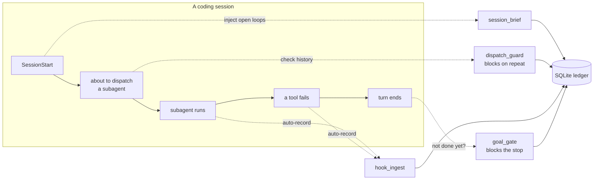

# nagi-ledger

[](https://github.com/watasisaikou/nagi-ledger/actions/workflows/ci.yml)
[](https://www.python.org/downloads/)
[](LICENSE)

**English** | [日本語](README.md)

**An audit ledger and guardrail toolkit for autonomous AI coding agents.**
MCP server + Claude Code hooks. Standard library only, apart from the MCP SDK.

When you let an AI agent work on its own, two questions get hard to answer:

- **What did it actually do?** Which subagents did it dispatch, how many times did it retry, what did verification conclude?
- **How do you stop it repeating a mistake?** A dead end discovered on Monday gets re-attempted on Friday, because nothing remembers it.

nagi-ledger answers both, and — this is the part that matters — it does so **mechanically**, not by asking the agent to be disciplined. Every dispatch is recorded by a hook the agent does not control. Every known dead end is checked *before* the next attempt, and the attempt is blocked if one applies.

> An agent asked to remember its mistakes will forget.
> An agent *stopped* by a record of its mistakes cannot.

---

## What it does



Five components, each wired to a different point of the agent's lifecycle:

| Component | Hook | What it does |
|---|---|---|
| **`session_brief.py`** | `SessionStart`, `PostCompact` | Injects the *open loops* — an active goal, dispatches still awaiting verification, recent dead ends, repos with uncommitted work. Prints **nothing at all** when everything is closed, so a clean session costs zero context. |
| **`dispatch_guard.py`** | `PreToolUse` (Agent) | Before a subagent is dispatched, looks up that task's retry count and recorded dead ends. **Blocks** (exit 2) with the reason when the retry budget is exceeded or a known dead end applies. Silent otherwise. |
| **`hook_ingest.py`** | `PostToolUse`, `PostToolUseFailure` | Records every subagent dispatch and every tool failure into the ledger. Runs async; the agent has no say in it. |
| **`goal_gate.py`** | `Stop` | While a goal is active, **blocks the agent from ending its turn** (via a `{"decision": "block", "reason": "..."}` reply, exit 0 — the `Stop` hook's own contract) until it explicitly declares the goal done — with a turn budget so it can never loop forever. |
| **`server.py`** | MCP (stdio) | Exposes the ledger as 8 MCP tools so the agent can query and annotate it deliberately: record a verdict, register a dead end, generate a session report. |

The ledger itself (`ledger.py`) is a dependency-free module containing no MCP or hook code, so every function is directly unit-testable.

---

## Output language

`session_brief.py` injects its `SessionStart`/`PostCompact` briefing text — headers like
`## 開いてるループ`, `### アクティブ goal`, `### 検証待ち`, `### 直近の dead-end`, `### 未 commit` —
**in Japanese**, directly into your agent's context on every session start. The `ledger_session_report`
MCP tool (`ledger.py`'s `session_report()`) is the same story: its Markdown header is
`## 自律実行リスト`. That is what a reader gets by wiring these two pieces in, with no warning.

This is not a documentation gap so much as a fact about the project: it is the author's own daily
tool, in the author's own language, and it has not been translated. There is currently no way to
switch it to English — no `NAGI_LANG` or equivalent env var exists.

The rest of the toolkit is English. `goal_gate.py`'s own hook output (`stop-gate`'s block reason,
CLI messages, `status`) is English template text; the one place Japanese can appear is your goal
text itself, echoed back verbatim if you `set` one in Japanese — that is your input, not the
script's. `dispatch_guard.py`'s block reason is English scaffolding around whatever language your
own recorded dead-end reasons are in. `hook_ingest.py` writes nothing to stdout and only debug
lines to stderr. If injected Japanese is a blocker for you, leave `session_brief.py` unwired and
avoid calling `ledger_session_report`; the rest of the toolkit does not have this issue.

---

## Why the guardrails are hooks, not instructions

The design rule this project is built on:

> **A rule the agent must remember is a suggestion. A rule enforced by the harness is a constraint.**

You can write *"do not retry the same failing approach more than twice"* in a prompt. It will hold until the context gets long, or the model gets confident, or a summary drops that line. `dispatch_guard` makes the same rule an `exit 2`.

Two consequences shaped the implementation:

**Guards fail open.** Every hook exits 0 on *any* internal error. A broken guard that blocks all dispatches is worse than no guard, so a crash, a missing database, or a locked file all resolve to "allow, and complain on stderr". There is one place where fail-open is impossible: a `SessionStart` hook that blocks on stdin cannot be rescued by an exception handler, because no exception is raised — it simply hangs, and the session never starts. That path is closed by never reading stdin at all, with a regression test that spawns the script against an open, unclosed pipe.

**`dispatch_guard`'s `PreToolUse` blocks are signalled by exit code, not JSON.** An earlier version returned a `permissionDecision: "ask"` payload. Under Claude Code's `auto` permission mode that decision is silently swallowed: the guard decided correctly, the dispatch proceeded anyway, and the reason reached nobody. Exit code 2 is honored in every permission mode. A guard that is not heard is not a guard. This is specific to `PreToolUse` and `permissionDecision: "ask"` — it is not a blanket rule for every hook here. `goal_gate.py`'s `Stop` hook uses a different, correct mechanism for its own event type: it prints `{"decision": "block", "reason": "..."}` on stdout and exits 0, which is exactly the `Stop` hook's documented contract (see the component table above). If you run `stop-gate` by hand and see that JSON on stdout with exit 0, that is not a contradiction of the rule above — it is a different hook event with a different protocol.

---

## Quick start

Requires Python 3.10+.

```bash
git clone https://github.com/watasisaikou/nagi-ledger.git
cd nagi-ledger
python -m venv .venv
.venv/bin/pip install -r requirements-dev.txt   # Windows: .venv\Scripts\pip
.venv/bin/pytest -q
```

`requirements.txt` holds the single runtime dependency (the MCP SDK, needed
only by `server.py`); `requirements-dev.txt` adds pytest.

### Register the MCP server

```bash
claude mcp add nagi-ledger -s user -- /abs/path/.venv/bin/python /abs/path/server.py
```

Use the interpreter from the virtualenv — the MCP server needs the `mcp` package. The hook scripts deliberately do **not**: they are standard library only, so they run under any Python.

### Wire the hooks

Add to `~/.claude/settings.json`, replacing `PY` with your interpreter and `DIR` with the checkout path:

```json
{
  "hooks": {
    "SessionStart": [
      { "hooks": [{ "type": "command", "command": "PY DIR/session_brief.py", "timeout": 15 }] }
    ],
    "PostCompact": [
      { "hooks": [{ "type": "command", "command": "PY DIR/session_brief.py", "timeout": 15 }] }
    ],
    "PreToolUse": [
      { "matcher": "Agent|Task",
        "hooks": [{ "type": "command", "command": "PY DIR/dispatch_guard.py", "timeout": 15 }] }
    ],
    "PostToolUse": [
      { "matcher": "Agent|Task",
        "hooks": [{ "type": "command", "command": "PY DIR/hook_ingest.py agent-dispatch", "timeout": 30, "async": true }] }
    ],
    "PostToolUseFailure": [
      { "hooks": [{ "type": "command", "command": "PY DIR/hook_ingest.py tool-failure", "timeout": 30, "async": true }] }
    ],
    "Stop": [
      { "hooks": [{ "type": "command", "command": "PY DIR/goal_gate.py stop-gate", "timeout": 15 }] }
    ]
  }
}
```

`SessionStart` and `PostCompact` get the same script. Compaction leaves the session in the state a
fresh one starts in — the open work has fallen out of context — so it needs the same remedy.

Each piece is independent — wire only the ones you want.

### Try the hooks by hand

Each hook script reads one JSON object from stdin — the same shape Claude Code pipes in for
`PostToolUse`/`PreToolUse` — so you can feed it by hand and watch a row land, without waiting for a
real dispatch. These examples use `tool_name: "Agent"`, matching `dispatch_guard`'s `PreToolUse`
matcher and the check in `hook_ingest.py`/`dispatch_guard.py` above; if your installation reports
the subagent-dispatch tool under a different name, both the matcher in **Wire the hooks** and that
check need to agree with whatever your Claude Code actually sends — inspect the real hook event
JSON before relying on this.

**1. `hook_ingest.py agent-dispatch` — record a dispatch**

```bash
echo '{
  "tool_name": "Agent",
  "tool_input": {
    "subagent_type": "general-purpose",
    "model": "sonnet",
    "description": "fix the flaky widget test",
    "prompt": "Investigate and fix the flaky test in test_widget.py."
  }
}' | PY DIR/hook_ingest.py agent-dispatch
```

Exits 0, prints nothing to stdout (stderr gets `dispatch_id=1`, for debugging only). Confirm the row landed:

```bash
sqlite3 ~/.nagi/ledger.db "select id, task, agent_type, model from dispatches order by id desc limit 1;"
```

A payload with no `tool_input`, a `tool_name` other than `"Agent"`, or a `tool_input` that isn't a
JSON object is treated as "nothing to record" and silently no-ops (still exit 0, still zero rows)
— that is by design, not a bug: see **Guards fail open** above.

**2. `hook_ingest.py tool-failure` — record a failed tool call**

```bash
echo '{
  "tool_name": "Bash",
  "tool_input": {"command": "pytest -q"},
  "tool_response": {"error": "1 failed, 2 passed"}
}' | PY DIR/hook_ingest.py tool-failure
```

Inserts one row into `actions` (`tier=0`, `category=tool_failure`, `description="Bash: 1 failed, 2 passed"`).

**3. `dispatch_guard.py` — block a repeated dispatch**

Feed the *same* `agent-dispatch` payload from step 1 through `hook_ingest.py` two more times (three
total, same `description`) so the task's retry count reaches the limit, then send the same payload
to `dispatch_guard.py` as a `PreToolUse` event:

```bash
PAYLOAD='{
  "tool_name": "Agent",
  "tool_input": {
    "subagent_type": "general-purpose",
    "model": "sonnet",
    "description": "fix the flaky widget test",
    "prompt": "Investigate and fix the flaky test in test_widget.py."
  }
}'
echo "$PAYLOAD" | PY DIR/hook_ingest.py agent-dispatch   # dispatch 2
echo "$PAYLOAD" | PY DIR/hook_ingest.py agent-dispatch   # dispatch 3
echo "$PAYLOAD" | PY DIR/dispatch_guard.py                # now blocked
echo "exit=$?"
```

```
BLOCKED by dispatch_guard.
Task: fix the flaky widget test
prior dispatches: 3, last verdict: PENDING
Budget rule: same-purpose retries are limited to 2.
Proceed only if you have new information that invalidates the above; otherwise change approach or stop.
exit=2
```

### Use the goal gate

```bash
python goal_gate.py set "all tests green and the CHANGELOG updated" --max-turns 20
python goal_gate.py status
python goal_gate.py extend 10          # blocked waiting on background work
python goal_gate.py done "200 tests green, CHANGELOG committed in a1b2c3d"
```

Until `done` (or `abort`, or budget exhaustion) the agent cannot end its turn.

---

## MCP tools

| Tool | Purpose |
|---|---|
| `ledger_log_action(tier, category, description, project=None)` | Record an autonomous action, tiered 0–2 by impact. |
| `ledger_log_dispatch(task, agent_type, model, brief_summary)` | Record a subagent dispatch; returns the prior retry count for that task. |
| `ledger_log_verdict(dispatch_id, verdict, notes=None)` | Attach `CONFIRMED` / `REFUTED` / `PARTIAL` to a dispatch. |
| `ledger_task_status(task)` | Retry count, last verdict, and `over_retry_limit` for a task. |
| `ledger_log_approach(task, approach, outcome, reason)` | Register an approach as `DEAD_END` / `NO_GO` / `WORKS`. |
| `ledger_check_approaches(task)` | What has already been tried for this task, and how it went. |
| `ledger_session_report(since_hours=24)` | Markdown report of recent actions and dispatches. |
| `ledger_stats(days=7)` | Aggregate counts by tier, category, and verdict. |
| `ledger_search(query, kinds=None, limit=20, offset=0, since_days=None)` | Cross-table keyword search over actions/dispatches/approaches, returning index rows only (no body text). |
| `ledger_similar_tasks(task, limit=5, min_score=0.35)` | Finds reworded duplicate tasks that an exact-string match would miss. |

Recording a dispatch is automatic — the hook does it. Recording a **verdict** stays deliberate and manual: deciding whether work is actually correct is a judgement, and automating it would defeat the purpose.

---

## Storage

SQLite at `~/.nagi/ledger.db`, three tables: `actions`, `dispatches`, `approaches`. WAL mode, because async hooks can fire concurrently and a lost write is a silent hole in the audit trail.

Every path is overridable by environment variable, which is also how the test suite keeps its hands off your real ledger:

| Variable | Default |
|---|---|
| `NAGI_LEDGER_DB` | `~/.nagi/ledger.db` |
| `NAGI_GOAL_FILE` | `~/.nagi/goal.json` |
| `NAGI_GOAL_HISTORY` | `~/.nagi/goal_history.jsonl` |
| `NAGI_BRIEF_REPOS` | the current git repository, if any |

---

## Tests

```bash
.venv/bin/pytest -q                     # Windows: .venv\Scripts\pytest; 200 tests
.venv/bin/python tests/smoke_stdio.py   # Windows: .venv\Scripts\python; spawns the MCP server over stdio and calls it
```

Use the virtualenv interpreter for `smoke_stdio.py`, not a bare `python` — it imports the `mcp` package
to drive the server, and a system Python without that package fails with
`ModuleNotFoundError: No module named 'mcp'`.

CI runs both on Linux and Windows against Python 3.10 and 3.12.

The suite covers considerably more than the happy path, because the failure modes are the point:

- **Fail-open under damage** — unreadable database, a file where a directory should be, garbage on stdin, a JSON array instead of an object. Every case must still allow the operation.
- **No-write proofs** — the read-only components snapshot every table's row count before and after, and assert equality. An audit tool that mutates what it audits is worthless.
- **Non-ASCII round-trips through subprocesses** — recorded reasons are often not in English, and the Windows console codepage cannot represent them. This was a real bug: `json.dumps` had been escaping non-ASCII and hiding it, and switching to plain text on stderr exposed it immediately.
- **The stdin hang** — a subprocess is spawned with an open, never-closed stdin pipe, and must exit promptly.

---

## Status and scope

A working tool, used daily — not a framework. It is deliberately small: SQLite and the standard library, one file per concern, no plugin system. It targets [Claude Code](https://code.claude.com) hooks specifically; the MCP server half works with any MCP client.

Known limitations, in rough priority order:

- **No `wait` primitive on the goal gate.** It cannot distinguish "blocked waiting on a background agent" from "stopped early", so waiting consumes the turn budget. `extend` is the current workaround.
- **Concurrent `stop-gate` invocations are not serialised.** The state file is a read-modify-write with no locking. Single-session use — the only supported mode — never hits this.
- **Injected text is Japanese, not configurable.** `session_brief.py`'s briefing and the `ledger_session_report` MCP tool are hardcoded Japanese; see [Output language](#output-language) above. No `NAGI_LANG` switch exists today.

## License

MIT — see [LICENSE](LICENSE).
