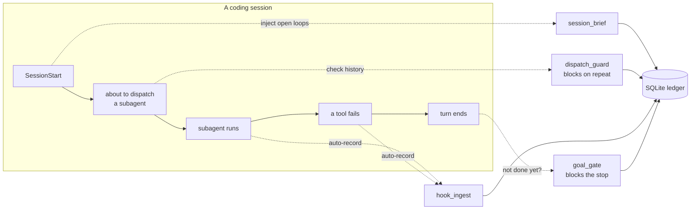

# nagi-ledger

**An audit ledger and guardrail toolkit for autonomous AI coding agents.**
MCP server + Claude Code hooks. Standard library only, apart from the MCP SDK.

When you let an AI agent work on its own, two questions get hard to answer:

- **What did it actually do?** Which subagents did it dispatch, how many times did it retry, what did verification conclude?
- **How do you stop it repeating a mistake?** A dead end discovered on Monday gets re-attempted on Friday, because nothing remembers it.

nagi-ledger answers both, and — this is the part that matters — it does so **mechanically**, not by asking the agent to be disciplined. Every dispatch is recorded by a hook the agent does not control. Every known dead end is checked *before* the next attempt, and the attempt is blocked if one applies.

> An agent asked to remember its mistakes will forget.
> An agent *stopped* by a record of its mistakes cannot.

---

## What it does



Five components, each wired to a different point of the agent's lifecycle:

| Component | Hook | What it does |
|---|---|---|
| **`session_brief.py`** | `SessionStart` | Injects the *open loops* — an active goal, dispatches still awaiting verification, recent dead ends, repos with uncommitted work. Prints **nothing at all** when everything is closed, so a clean session costs zero context. |
| **`dispatch_guard.py`** | `PreToolUse` (Agent) | Before a subagent is dispatched, looks up that task's retry count and recorded dead ends. **Blocks** (exit 2) with the reason when the retry budget is exceeded or a known dead end applies. Silent otherwise. |
| **`hook_ingest.py`** | `PostToolUse`, `PostToolUseFailure` | Records every subagent dispatch and every tool failure into the ledger. Runs async; the agent has no say in it. |
| **`goal_gate.py`** | `Stop` | While a goal is active, **blocks the agent from ending its turn** until it explicitly declares the goal done — with a turn budget so it can never loop forever. |
| **`server.py`** | MCP (stdio) | Exposes the ledger as 8 MCP tools so the agent can query and annotate it deliberately: record a verdict, register a dead end, generate a session report. |

The ledger itself (`ledger.py`) is a dependency-free module containing no MCP or hook code, so every function is directly unit-testable.

---

## Why the guardrails are hooks, not instructions

The design rule this project is built on:

> **A rule the agent must remember is a suggestion. A rule enforced by the harness is a constraint.**

You can write *"do not retry the same failing approach more than twice"* in a prompt. It will hold until the context gets long, or the model gets confident, or a summary drops that line. `dispatch_guard` makes the same rule an `exit 2`.

Two consequences shaped the implementation:

**Guards fail open.** Every hook exits 0 on *any* internal error. A broken guard that blocks all dispatches is worse than no guard, so a crash, a missing database, or a locked file all resolve to "allow, and complain on stderr". There is one place where fail-open is impossible: a `SessionStart` hook that blocks on stdin cannot be rescued by an exception handler, because no exception is raised — it simply hangs, and the session never starts. That path is closed by never reading stdin at all, with a regression test that spawns the script against an open, unclosed pipe.

**Blocks are signalled by exit code, not JSON.** An earlier version returned a `permissionDecision: "ask"` payload. Under Claude Code's `auto` permission mode that decision is silently swallowed: the guard decided correctly, the dispatch proceeded anyway, and the reason reached nobody. Exit code 2 is honored in every permission mode. A guard that is not heard is not a guard.

---

## Quick start

Requires Python 3.10+.

```bash
git clone https://github.com/<you>/nagi-ledger.git
cd nagi-ledger
python -m venv .venv
.venv/bin/pip install -r requirements-dev.txt   # Windows: .venv\Scripts\pip
.venv/bin/pytest -q
```

`requirements.txt` holds the single runtime dependency (the MCP SDK, needed
only by `server.py`); `requirements-dev.txt` adds pytest.

### Register the MCP server

```bash
claude mcp add nagi-ledger -s user -- /abs/path/.venv/bin/python /abs/path/server.py
```

Use the interpreter from the virtualenv — the MCP server needs the `mcp` package. The hook scripts deliberately do **not**: they are standard library only, so they run under any Python.

### Wire the hooks

Add to `~/.claude/settings.json`, replacing `PY` with your interpreter and `DIR` with the checkout path:

```json
{
  "hooks": {
    "SessionStart": [
      { "hooks": [{ "type": "command", "command": "PY DIR/session_brief.py", "timeout": 15 }] }
    ],
    "PreToolUse": [
      { "matcher": "Agent",
        "hooks": [{ "type": "command", "command": "PY DIR/dispatch_guard.py", "timeout": 15 }] }
    ],
    "PostToolUse": [
      { "matcher": "Agent",
        "hooks": [{ "type": "command", "command": "PY DIR/hook_ingest.py agent-dispatch", "timeout": 30, "async": true }] }
    ],
    "PostToolUseFailure": [
      { "hooks": [{ "type": "command", "command": "PY DIR/hook_ingest.py tool-failure", "timeout": 30, "async": true }] }
    ],
    "Stop": [
      { "hooks": [{ "type": "command", "command": "PY DIR/goal_gate.py stop-gate", "timeout": 15 }] }
    ]
  }
}
```

Each piece is independent — wire only the ones you want.

### Use the goal gate

```bash
python goal_gate.py set "all tests green and the CHANGELOG updated" --max-turns 20
python goal_gate.py status
python goal_gate.py extend 10          # blocked waiting on background work
python goal_gate.py done "127 tests green, CHANGELOG committed in a1b2c3d"
```

Until `done` (or `abort`, or budget exhaustion) the agent cannot end its turn.

---

## MCP tools

| Tool | Purpose |
|---|---|
| `ledger_log_action(tier, category, description, project=None)` | Record an autonomous action, tiered 0–2 by impact. |
| `ledger_log_dispatch(task, agent_type, model, brief_summary)` | Record a subagent dispatch; returns the prior retry count for that task. |
| `ledger_log_verdict(dispatch_id, verdict, notes=None)` | Attach `CONFIRMED` / `REFUTED` / `PARTIAL` to a dispatch. |
| `ledger_task_status(task)` | Retry count, last verdict, and `over_retry_limit` for a task. |
| `ledger_log_approach(task, approach, outcome, reason)` | Register an approach as `DEAD_END` / `NO_GO` / `WORKS`. |
| `ledger_check_approaches(task)` | What has already been tried for this task, and how it went. |
| `ledger_session_report(since_hours=24)` | Markdown report of recent actions and dispatches. |
| `ledger_stats(days=7)` | Aggregate counts by tier, category, and verdict. |

Recording a dispatch is automatic — the hook does it. Recording a **verdict** stays deliberate and manual: deciding whether work is actually correct is a judgement, and automating it would defeat the purpose.

---

## Storage

SQLite at `~/.nagi/ledger.db`, three tables: `actions`, `dispatches`, `approaches`. WAL mode, because async hooks can fire concurrently and a lost write is a silent hole in the audit trail.

Every path is overridable by environment variable, which is also how the test suite keeps its hands off your real ledger:

| Variable | Default |
|---|---|
| `NAGI_LEDGER_DB` | `~/.nagi/ledger.db` |
| `NAGI_GOAL_FILE` | `~/.nagi/goal.json` |
| `NAGI_GOAL_HISTORY` | `~/.nagi/goal_history.jsonl` |
| `NAGI_BRIEF_REPOS` | the current git repository, if any |

---

## Tests

```bash
pytest -q                     # 127 tests
python tests/smoke_stdio.py   # spawns the MCP server over stdio and calls it
```

CI runs both on Linux and Windows against Python 3.10 and 3.12.

The suite covers considerably more than the happy path, because the failure modes are the point:

- **Fail-open under damage** — unreadable database, a file where a directory should be, garbage on stdin, a JSON array instead of an object. Every case must still allow the operation.
- **No-write proofs** — the read-only components snapshot every table's row count before and after, and assert equality. An audit tool that mutates what it audits is worthless.
- **Non-ASCII round-trips through subprocesses** — recorded reasons are often not in English, and the Windows console codepage cannot represent them. This was a real bug: `json.dumps` had been escaping non-ASCII and hiding it, and switching to plain text on stderr exposed it immediately.
- **The stdin hang** — a subprocess is spawned with an open, never-closed stdin pipe, and must exit promptly.

---

## Status and scope

A working tool, used daily — not a framework. It is deliberately small: SQLite and the standard library, one file per concern, no plugin system. It targets [Claude Code](https://code.claude.com) hooks specifically; the MCP server half works with any MCP client.

Not implemented, in rough priority order: automated test coverage for `goal_gate extend`, a `wait` primitive so the goal gate can distinguish "blocked on background work" from "stopped early", and re-injecting context after compaction.

## License

MIT — see [LICENSE](LICENSE).
