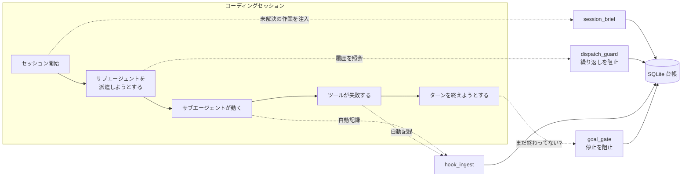

# nagi-ledger

[](https://github.com/namakoo-dev/nagi-ledger/actions/workflows/ci.yml)
[](https://www.python.org/downloads/)
[](LICENSE)

**日本語** | [English](README.en.md)

**自律型 AI コーディングエージェントのための監査台帳とガードレール。**
MCP サーバー + Claude Code hooks。MCP SDK を除いて標準ライブラリのみで動きます。

AI エージェントに単独で作業をさせると、2 つの問いに答えられなくなります。

- **実際に何をしたのか。** どのサブエージェントを派遣し、何回リトライし、検証は何と結論したのか。
- **同じ失敗をどう止めるのか。** 月曜に判明した行き止まりが、金曜にまた試される。何も覚えていないからです。

nagi-ledger はこの両方に答えます。そして重要なのは、**エージェントの自制心に頼らず、機構として**答える点です。派遣はエージェント自身が制御できない hook が記録します。既知の行き止まりは次の試行の**前**に照会され、該当すれば試行そのものが阻止されます。

> 記憶するよう指示された規則は、単なる提案にすぎない。
> ハーネスが強制する規則だけが、制約になる。

---

## 何をするものか



構成要素は 6 つ。それぞれエージェントのライフサイクルの別々の地点に接続されます。

| 構成要素 | フック | 役割 |
|---|---|---|
| **`session_brief.py`** | `SessionStart`, `PostCompact` | **未解決の作業**をセッション開始時に注入します。進行中の目標、検証待ちの派遣、直近の行き止まり、未コミットの変更が残るリポジトリ。すべて片付いているときは**何も出力しません**。つまり、綺麗な状態のセッションではコンテキストを 1 バイトも消費しません。 |
| **`dispatch_guard.py`** | `PreToolUse` (Agent) | サブエージェントを派遣する直前に、そのタスクのリトライ回数と記録済みの行き止まりを照会します。リトライ上限を超えている場合、または既知の行き止まりに該当する場合は、理由を添えて**阻止**します (exit 2)。それ以外のときは沈黙します。 |
| **`hook_ingest.py`** | `PostToolUse`, `PostToolUseFailure` | すべてのサブエージェント派遣とツール失敗を台帳に記録します。非同期で走り、エージェントに拒否権はありません。 |
| **`goal_gate.py`** | `Stop` | 目標が設定されている間、**エージェントがターンを終えることを阻止**します (`{"decision": "block", "reason": "..."}` を返し exit 0 — `Stop` フック自体の契約です)。明示的に「完了」を宣言するまで止まれません。ただしターン予算があるため、無限ループにはなりません。 |
| **`server.py`** | MCP (stdio) | 台帳を 10 個の MCP ツールとして公開します。エージェントが意図的に台帳を読み書きするための口です。検証結果の記録、行き止まりの登録、セッションレポートの生成など。 |
| **`export_json.py`** | (フックではない、手動 CLI) | 台帳全体を 1 つの JSON に読み取り専用でエクスポートします。[ledger-view](https://github.com/namakoo-dev/ledger-view) — 素の TS SPA — がこの JSON を読んで台帳を可視化します。 |

台帳の本体 (`ledger.py`) は MCP のコードもフックのコードも一切含まない依存ゼロのモジュールです。そのため、すべての関数を直接ユニットテストできます。

---

## 出力言語について

`session_brief.py` が `SessionStart`/`PostCompact` で注入するブリーフィング — `## 開いてるループ`、`### アクティブ goal`、`### 検証待ち`、`### 直近の dead-end`、`### 未 commit` といった見出し — は**日本語で固定**されており、セッション開始のたびにエージェントのコンテキストへそのまま入ります。`ledger_session_report` という MCP ツール (`ledger.py` の `session_report()`) も同様で、Markdown の見出しは `## 自律実行リスト` です。

これはドキュメント不足というより、このプロジェクトの前提そのものです。開発者本人が日常的に日本語で使っているツールであり、翻訳はされていません。今のところ英語に切り替える手段はありません (`NAGI_LANG` のような環境変数は存在しません)。

それ以外は英語です。`goal_gate.py` 自身の出力 (`stop-gate` の阻止理由、CLI のメッセージ、`status`) は英語のテンプレートで、日本語が混じり得るのは `set` で登録した goal テキスト自身がそのままエコーされる場合だけです — それはスクリプトの言語ではなく、あなたの入力です。`dispatch_guard.py` の阻止理由も英語の枠組みに、記録した dead-end の理由 (あなた自身が書いた言語) が差し込まれる形です。`hook_ingest.py` は標準出力に何も書かず、デバッグ用の行だけを stderr に書きます。注入される日本語が困る場合は、`session_brief.py` を接続しない、`ledger_session_report` を呼ばないようにしてください。それ以外の要素にはこの問題はありません。

---

## なぜ「指示」ではなく「フック」なのか

このプロジェクトが立脚している設計原則です。

> **エージェントが覚えていなければならない規則は、提案にすぎない。**
> **ハーネスが強制する規則だけが、制約になる。**

プロンプトに *「同じ失敗する手法を 2 回を超えて繰り返さないこと」* と書くことはできます。それはコンテキストが長くなるまで、あるいはモデルが自信を持つまで、あるいは要約がその一行を落とすまでは有効です。`dispatch_guard` は同じ規則を `exit 2` にします。

この方針から、実装上の判断が 2 つ導かれました。

### ガードは必ず「開く方向」に倒れる (fail open)

すべてのフックは、**内部エラーが起きたら必ず exit 0 で終了**します。全部の派遣を阻止する壊れたガードは、ガードが無いより悪いからです。クラッシュも、データベースの欠損も、ファイルロックも、すべて「通す。ただし stderr に文句を書く」に解決されます。

ただし fail open が原理的に不可能な箇所が 1 つあります。**`SessionStart` フックが標準入力で待ちに入った場合、例外ハンドラでは救えません。** 例外が発生しないからです。ただ固まり、セッションが永遠に始まらないだけです。この経路は「標準入力を一切読まない」ことで塞いであり、**開いたまま閉じられていないパイプに対してスクリプトを起動する回帰テスト**で守っています。

### `dispatch_guard` の阻止は JSON ではなく終了コードで伝える

初期の実装では `permissionDecision: "ask"` という JSON を返していました。しかし Claude Code の `auto` 権限モードでは、**この判断は黙って握りつぶされます。** ガードは正しく判断したのに、派遣はそのまま実行され、理由は誰にも届きませんでした。

終了コード 2 はすべての権限モードで尊重されます。**届かないガードは、ガードではありません。**

これは `PreToolUse` と `permissionDecision: "ask"` に固有の話であり、ここにあるすべてのフックに対する一般則ではありません。`goal_gate.py` の `Stop` フックは自分のイベント種別に合った別の (正しい) 仕組みを使っています。`{"decision": "block", "reason": "..."}` を標準出力に出して exit 0 で終了する、これが `Stop` フック自体が定める契約どおりの動きです (上の構成要素の表を参照)。`stop-gate` を手で実行してこの JSON と exit 0 を見ても、それは上記の原則と矛盾しているわけではなく、イベント種別が違えばプロトコルも違う、というだけです。

---

## 使い方

Python 3.10 以上が必要です。

```bash
git clone https://github.com/namakoo-dev/nagi-ledger.git
cd nagi-ledger
python -m venv .venv
.venv/bin/pip install -r requirements-dev.txt   # Windows: .venv\Scripts\pip
.venv/bin/pytest -q
```

`requirements.txt` には実行時の唯一の依存 (MCP SDK、`server.py` のみが必要とします) が入っています。`requirements-dev.txt` はそれに pytest を加えたものです。

### MCP サーバーを登録する

```bash
claude mcp add nagi-ledger -s user -- /abs/path/.venv/bin/python /abs/path/server.py
```

MCP サーバーには `mcp` パッケージが必要なので、仮想環境側のインタプリタを指定してください。一方フックのスクリプトは**意図的に標準ライブラリのみ**で書かれているため、どの Python でも動きます。

### フックを接続する

`~/.claude/settings.json` に以下を追加します。`PY` をインタプリタのパス、`DIR` をチェックアウト先のパスに置き換えてください。

```json
{
  "hooks": {
    "SessionStart": [
      { "hooks": [{ "type": "command", "command": "PY DIR/session_brief.py", "timeout": 15 }] }
    ],
    "PostCompact": [
      { "hooks": [{ "type": "command", "command": "PY DIR/session_brief.py", "timeout": 15 }] }
    ],
    "PreToolUse": [
      { "matcher": "Agent|Task",
        "hooks": [{ "type": "command", "command": "PY DIR/dispatch_guard.py", "timeout": 15 }] }
    ],
    "PostToolUse": [
      { "matcher": "Agent|Task",
        "hooks": [{ "type": "command", "command": "PY DIR/hook_ingest.py agent-dispatch", "timeout": 30, "async": true }] }
    ],
    "PostToolUseFailure": [
      { "hooks": [{ "type": "command", "command": "PY DIR/hook_ingest.py tool-failure", "timeout": 30, "async": true }] }
    ],
    "Stop": [
      { "hooks": [{ "type": "command", "command": "PY DIR/goal_gate.py stop-gate", "timeout": 15 }] }
    ]
  }
}
```

`SessionStart` と `PostCompact` に同じスクリプトを渡しています。圧縮はセッション開始と同じ状況、つまり**未解決の作業が文脈から失われた状態**を作るため、必要な処置も同じです。

各要素は独立しています。**必要なものだけ接続して構いません。**

### フックを手で試す

各フックスクリプトは標準入力から JSON オブジェクトを 1 つ読みます。Claude Code が `PostToolUse`/`PreToolUse` で流し込むのと同じ形です。つまり、実際の派遣を待たなくても、手で流し込んで行が入るところを見られます。以下の例では `tool_name: "Agent"` を使っています。これは上の `dispatch_guard` の `PreToolUse` マッチャーと `hook_ingest.py`/`dispatch_guard.py` 側のチェックに合わせたものです。お使いの環境でサブエージェント派遣ツールの名前が違う場合は、**フックを接続する** のマッチャーとこのチェックの両方を、実際に Claude Code が送ってくる名前に合わせてください — 信用する前に、実際のフックイベント JSON を確認してください。

**1. `hook_ingest.py agent-dispatch` — 派遣を記録する**

```bash
echo '{
  "tool_name": "Agent",
  "tool_input": {
    "subagent_type": "general-purpose",
    "model": "sonnet",
    "description": "fix the flaky widget test",
    "prompt": "Investigate and fix the flaky test in test_widget.py."
  }
}' | PY DIR/hook_ingest.py agent-dispatch
```

exit 0 で終わり、標準出力には何も出ません (stderr にはデバッグ用に `dispatch_id=1` が出ます)。行が入ったことを確認するには:

```bash
sqlite3 ~/.nagi/ledger.db "select id, task, agent_type, model from dispatches order by id desc limit 1;"
```

`tool_input` が無い、`tool_name` が `"Agent"` 以外、`tool_input` が JSON オブジェクトでない、といった形は「記録すべきものが無い」として黙って何もしません (それでも exit 0、行数 0) — これはバグではなく意図的な設計です。上の「ガードは必ず『開く方向』に倒れる」を参照してください。

**2. `hook_ingest.py tool-failure` — 失敗したツール呼び出しを記録する**

```bash
echo '{
  "tool_name": "Bash",
  "tool_input": {"command": "pytest -q"},
  "tool_response": {"error": "1 failed, 2 passed"}
}' | PY DIR/hook_ingest.py tool-failure
```

`actions` に 1 行挿入されます (`tier=0`、`category=tool_failure`、`description="Bash: 1 failed, 2 passed"`)。

**3. `dispatch_guard.py` — 繰り返された派遣を阻止する**

手順 1 と同じ `agent-dispatch` ペイロードを `hook_ingest.py` にあと 2 回 (同じ `description` で計 3 回) 流し込んでそのタスクのリトライ回数を上限に到達させ、続けて同じペイロードを `PreToolUse` イベントとして `dispatch_guard.py` に送ります。

```bash
PAYLOAD='{
  "tool_name": "Agent",
  "tool_input": {
    "subagent_type": "general-purpose",
    "model": "sonnet",
    "description": "fix the flaky widget test",
    "prompt": "Investigate and fix the flaky test in test_widget.py."
  }
}'
echo "$PAYLOAD" | PY DIR/hook_ingest.py agent-dispatch   # 2 回目の派遣
echo "$PAYLOAD" | PY DIR/hook_ingest.py agent-dispatch   # 3 回目の派遣
echo "$PAYLOAD" | PY DIR/dispatch_guard.py                # ここで阻止される
echo "exit=$?"
```

```
BLOCKED by dispatch_guard.
Task: fix the flaky widget test
prior dispatches: 3, last verdict: PENDING
Budget rule: same-purpose retries are limited to 2.
Proceed only if you have new information that invalidates the above; otherwise change approach or stop.
exit=2
```

### 目標ゲートを使う

```bash
python goal_gate.py set "全テストが緑で CHANGELOG が更新されていること" --max-turns 20
python goal_gate.py status
python goal_gate.py extend 10          # バックグラウンド処理の完了待ちで予算が足りないとき
python goal_gate.py done "214 テスト緑、CHANGELOG を a1b2c3d でコミット"
```

`done` を宣言するまで (あるいは `abort` するか、ターン予算が尽きるまで)、エージェントはターンを終えられません。

### 台帳を JSON でエクスポートする

```bash
python export_json.py                 # 既定 DB を標準出力へ
python export_json.py --out ledger.json
python export_json.py --db /path/to/other/ledger.db
```

`actions` / `dispatches` / `approaches` の全行を、間引きなしで 1 つの JSON にまとめます。台帳を書き換えることは決してありません (読み取り専用で開きます)。対象の DB が存在しない場合は空の DB を作らず、stderr に理由を出して exit 1 します。

出力は [ledger-view](https://github.com/namakoo-dev/ledger-view) — 素の TS SPA — でそのまま可視化できます。

---

## MCP ツール一覧

| ツール | 用途 |
|---|---|
| `ledger_log_action(tier, category, description, project=None)` | 自律実行した操作を記録する。影響度を 0〜2 の 3 段階で区別。 |
| `ledger_log_dispatch(task, agent_type, model, brief_summary)` | サブエージェントの派遣を記録し、**そのタスクのそれまでのリトライ回数を返す**。 |
| `ledger_log_verdict(dispatch_id, verdict, notes=None)` | 派遣に `CONFIRMED` / `REFUTED` / `PARTIAL` の検証結果を紐づける。 |
| `ledger_task_status(task)` | そのタスクのリトライ回数、直近の検証結果、リトライ上限超過フラグを返す。 |
| `ledger_log_approach(task, approach, outcome, reason)` | 試した手法を `DEAD_END` / `NO_GO` / `WORKS` として登録する。 |
| `ledger_check_approaches(task)` | そのタスクで既に何を試し、結果がどうだったかを返す。 |
| `ledger_session_report(since_hours=24)` | 直近の操作と派遣を Markdown レポートにする。 |
| `ledger_stats(days=7)` | 影響度・分類・検証結果ごとの集計。 |
| `ledger_search(query, kinds=None, limit=20, offset=0, since_days=None)` | actions/dispatches/approaches を横断キーワード検索し、本文を含まない索引行だけを返す。 |
| `ledger_similar_tasks(task, limit=5, min_score=0.35)` | 完全一致では拾えない、言い回しが違う重複タスクを類似度で検出する。 |

派遣の記録は**自動**です (フックがやります)。一方、**検証結果の記録は意図的に手動のまま**にしてあります。「その仕事が本当に正しいか」を決めるのは判断であり、そこを自動化したらこの仕組みの意味が失われるからです。

---

## データの保存先

`~/.nagi/ledger.db` に SQLite で保存します。テーブルは `actions` / `dispatches` / `approaches` の 3 つ。

WAL モードを使っています。非同期フックが同時に発火しうるためで、**書き込みが 1 件失われることは監査証跡に穴が開くこと**を意味するからです。

すべてのパスは環境変数で上書きできます。テストスイートが実際の台帳に触れないのも、この仕組みを使っています。

| 環境変数 | 既定値 |
|---|---|
| `NAGI_LEDGER_DB` | `~/.nagi/ledger.db` |
| `NAGI_GOAL_FILE` | `~/.nagi/goal.json` |
| `NAGI_GOAL_HISTORY` | `~/.nagi/goal_history.jsonl` |
| `NAGI_BRIEF_REPOS` | 現在の git リポジトリ (あれば) |

---

## テスト

```bash
.venv/bin/pytest -q                     # Windows: .venv\Scripts\pytest; 214 テスト
.venv/bin/python tests/smoke_stdio.py   # Windows: .venv\Scripts\python; MCP サーバーを stdio で起動して実際に呼ぶ
```

`smoke_stdio.py` は仮想環境のインタプリタで実行してください。素の `python` ではありません。
サーバーの操作に `mcp` パッケージを使うため、それが入っていないシステム Python では
`ModuleNotFoundError: No module named 'mcp'` で落ちます。

CI は Linux と Windows の両方で、Python 3.10 と 3.12 に対してこれらを実行します。

テストは正常系よりも**異常系に厚く**書いてあります。この種のツールでは、壊れ方こそが本題だからです。

- **破損状態での fail open** — 読めないデータベース、ディレクトリがあるべき場所にファイルがある状態、標準入力に流し込まれたゴミ、オブジェクトではなく JSON 配列。**すべてのケースで操作は通らなければなりません。**
- **「書き込まないこと」の証明** — 読み取り専用の要素については、全テーブルの行数を前後で記録して一致を検査します。**監査対象を書き換える監査ツールには価値がありません。**
- **非 ASCII 文字のサブプロセス往復** — 記録される理由は英語でないことが多く、Windows のコンソールコードページはそれを表現できません。これは実際に起きたバグでした。`json.dumps` が非 ASCII をエスケープして問題を隠しており、stderr への出力を平文に変えた瞬間に露出しました。
- **標準入力での固まり** — 開いたまま閉じられていない標準入力パイプを与えてサブプロセスを起動し、速やかに終了することを検査します。

---

## 現状と適用範囲

**日常的に使っている実働ツール**であり、フレームワークではありません。意図的に小さく作ってあります。SQLite と標準ライブラリのみ、1 つの関心事につき 1 ファイル、プラグイン機構なし。

[Claude Code](https://code.claude.com) のフックを対象にしていますが、MCP サーバー側は任意の MCP クライアントで動きます。

既知の制約を、影響の大きい順に挙げます。

- **目標ゲートに「待機」の概念がない。** 「バックグラウンド処理の完了を待っている」と「早々に諦めた」を区別できないため、待機がターン予算を消費します。現状の回避策は `extend` です。
- **`stop-gate` の同時実行が直列化されていない。** 状態ファイルはロックなしの read-modify-write です。単一セッションでの利用 (これが唯一のサポート対象です) では発生しません。
- **注入されるテキストは日本語で固定、切り替え不可。** `session_brief.py` のブリーフィングと `ledger_session_report` MCP ツールは日本語がハードコードされています。詳細は上の「出力言語について」を参照してください。今のところ `NAGI_LANG` のような切り替えはありません。

## ライセンス

MIT — [LICENSE](LICENSE) を参照してください。
